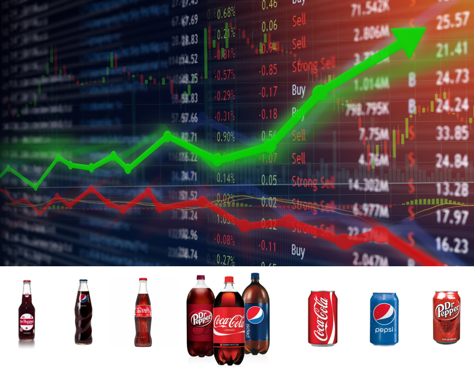

# Beverages Long Term Investment
### Description:
#### This a project of long term investment and see which soda beverages is a good long term investment. Analyzing historical data and calculate performance measurements, back-testing, and using Capital Asset Pricing Model.  

#### Stocks: DPS - Dr. Pepper
####        KO - Coca-Cola
####        PEP - Pepsi
        
#### Use accountant statements, excel, python, and Microsoft Azure Machine Learning Studio for Stocks Analysis

# Prerequistes
#### Python 3.5+

#### Jupyter Notebook Python 3

#### Excel 2016

#### Power BI

## Authors
* Tin Hang

## Disclaimer
### Do not use this code for investing or trading in the stock market. However, if you are interest in the stock market, you should read books investment, trading, stock market, and finance.

